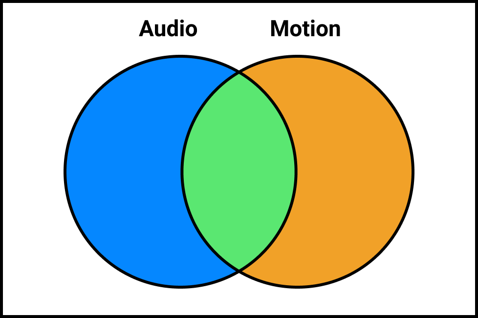
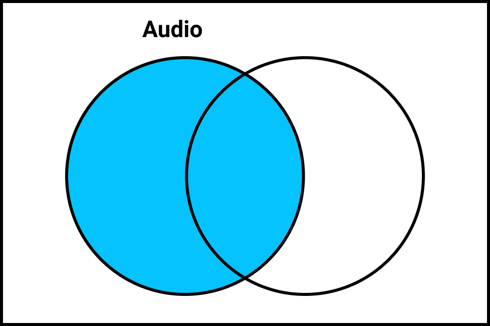
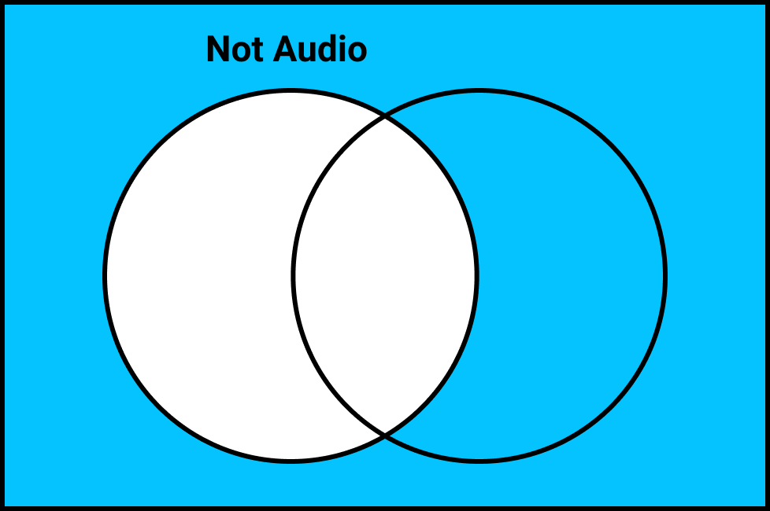
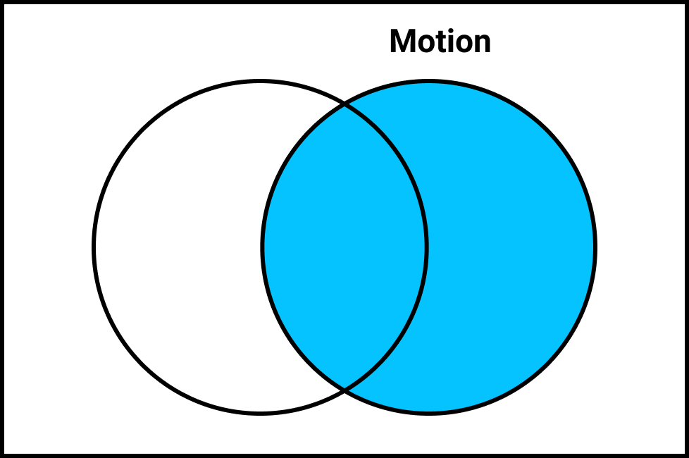
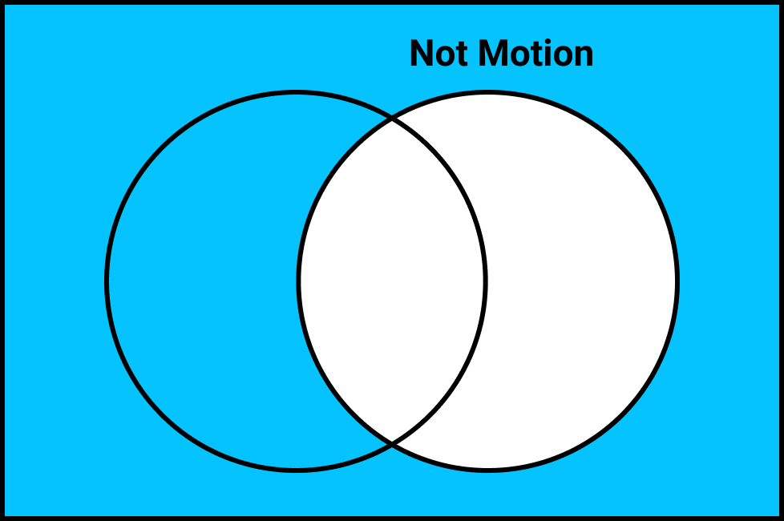
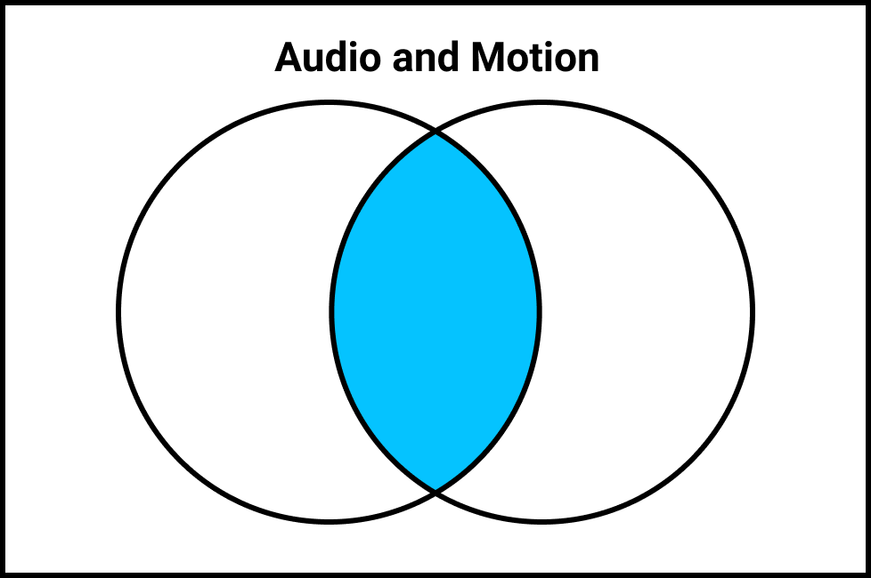
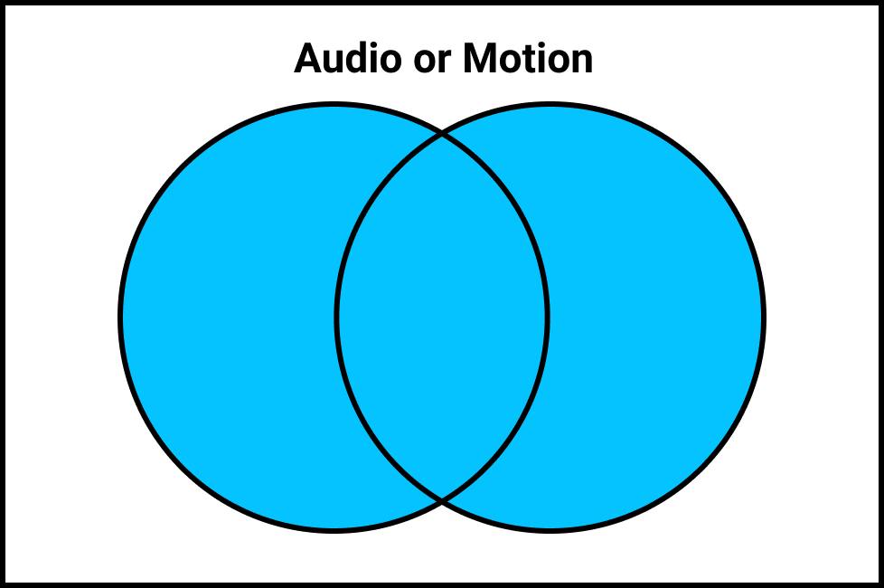

## How to Use Motion Detection


It's simple, just add `--edit_based_on motion`. The program will then look at each frame and determine the percentage of how many pixels have changed. You can choose what percentage motion is considered "active" by using `--motion_threshold`.

To remove the effect of random noise, each frame gets shrunked down and blurred before being compared.

Run `auto-editor --edit_based_on --help` to see all the options, and you should see the following.

```
audio,
motion,
not_audio,
not_motion,
audio_or_motion,
audio_and_motion,
audio_xor_motion,
audio_and_not_motion
```



Think of audio and motion like a venn diagram where the intercept is where the program detects both loudness and motion.

Audio byitself, (the default) would just be a circle.



and Not Audio (!Audio) would mean leave only where the program detects silence.



Motion works the same way.










Audio is based on

### How does frame margin fit into all this.